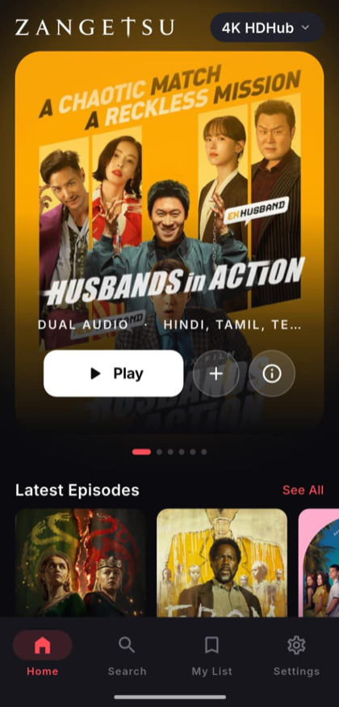
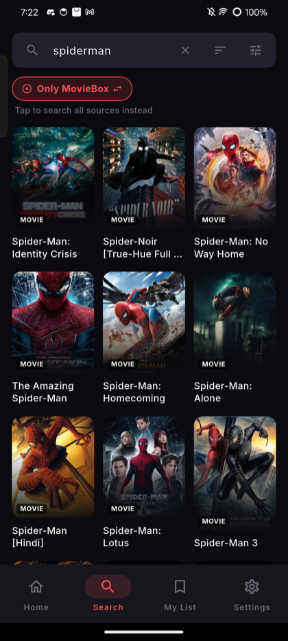
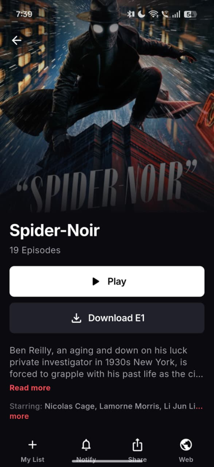
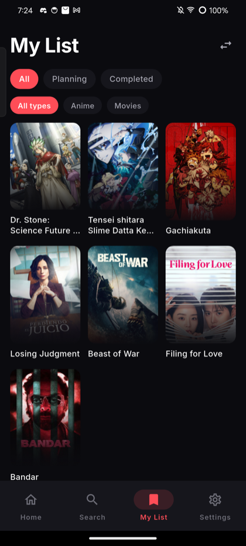

# Zangetsu

**A modern, open-source anime &amp; movie streaming app for Android.**

Browse, search and stream from many online sources — JavaScript modules _and_
CloudStream `.cs3` extensions — in one polished app.

 

 

---

## ✨ Features

#### 🎬 Browse &amp; discover

- **Netflix-style home** — a rotating cinematic hero with real **title-logo artwork**, content rows, and a one-tap **source switcher**.
- **Detail pages** with synopsis, **cast &amp; relations**, **trailers**, seasons/episodes, and a smooth shimmer while loading.

#### 🔎 CloudStream-grade search

- **Search every source at once** — results **grouped by source**, fastest sources first — or scope to **just the current source**.
- Live **suggestions** for both anime and movies/series as you type.
- **Filters** (type, source, genre, decade), **sort**, a **grid ⇄ rows** layout choice, and **See all** per source. Your choices are remembered.

#### ▶️ Player

- Built on **libmpv** (media_kit) — fast start, hardware decoding.
- **Gesture controls** — swipe for brightness/volume, long-press to fast-forward, drag-to-seek, pinch-to-zoom.
- **Skip-intro**, **resume** where you left off, **auto-play next episode** with up-next, **sub/dub** + **quality** switching, **volume boost**, and **subtitle styling** + online subtitles.

#### 📚 Library &amp; sync

- **My List** and **Continue Watching** that follow you across the app.
- Sign in to **sync** your list, progress and history across devices.
- **Offline downloads** that keep working with no connection and continue in the background.
- Auto-scrobble &amp; list import with **AniList**, **MyAnimeList** and **Simkl**.

#### 🧩 Sources you control

- Add sources any time from **Settings → Sources** — the catalog grows with **no app update**.
- **Source health** — test which of your sources are actually working, at a glance.
- Per-source settings, optional **DNS-over-HTTPS** to get around ISP blocking, and the search never nags you with "verifying" pop-ups.

#### ➕ And more

- **New-episode notifications** for shows you follow.
- **Discord Rich Presence** — show what you're watching.
- **In-app updates** straight from GitHub Releases.
- A clean, full **dark theme**.

---

## 📸 Screenshots

<table>
<tr>
<td></td>
<td></td>
<td></td>
<td></td>
</tr>
<tr align="center">
<td>Home</td><td>Search</td><td>Detail</td><td>My List</td>
</tr>
</table>

---

## ⬇️ Download

Grab the latest APK from the **[Releases page](https://github.com/Spyou/Zangetsu/releases/latest)**.

| APK                               | Use it if…                                                     |
| --------------------------------- | -------------------------------------------------------------- |
| `Zangetsu-vX.Y.Z-arm64-v8a.apk`   | You have a modern phone (most people) — smallest, recommended. |
| `Zangetsu-vX.Y.Z-armeabi-v7a.apk` | You have an older 32-bit device.                               |
| `Zangetsu-vX.Y.Z-universal.apk`   | Not sure — works on everything (largest).                      |

> The app checks GitHub Releases on launch and can update itself from inside **Settings → Check for updates**.

---

## 🧩 Sources

Zangetsu ships with a starter set of sources and lets you add more at any time
from **Settings → Sources** via the
**[Zangetsu providers repo](https://github.com/Spyou/zangetsu-providers)**.
It also installs **CloudStream `.cs3`** extensions, so a huge range of existing
community sources work out of the box.

---

## ⚠️ Disclaimer

Zangetsu **does not host, upload or distribute any content**. It is a player and
index that streams from third-party sources the user chooses to add. The
developers are not affiliated with those sources and are not responsible for the
content they serve. Use responsibly and in accordance with the laws of your
country.

---

 
<b>Zangetsu</b> — made with ❤️ for anime &amp; movie fans.

